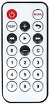
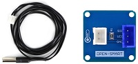
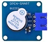
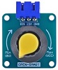

# SpaceTrek MakerBox

This entry level kit contains the basics you'll need to get started in the world of Arduino programming & electronics.

## Table of Contents
- [Getting Started](#getting-started)
  - [Install Arduino](#install-the-arduino-ide)
  - [Install MakerBox Library](#install-the-makerbox-library)
- [Using the Example Lessons](#using-the-example-lessons)
- [What's Included in the MakerBox](#whats-included-in-the-makerbox)
- [Lessons](#lessons)

## Getting Started

### What is Arduino
The MakerBox has an Arduino board and is programmed using the Arduino IDE. Arduino refers to an open-source electronics platform or board and the software used to program it. Arduino is designed to make electronics and programming more accessible to students, artists, designers, hobbyists and ayone interested in creating interactive objects or environments.  You will need to install Arduino on your computer and then install this library in Arduino to program the MakerBox.

### Install the Arduino IDE
The Arduino IDE can be found on the official Arduino website at https://www.arduino.cc/en/Main/Software

Download the version suitable for your computer and follow the prompts to install the software package.

Alternativly, if you are using Windows you can install Arduino through the Microsoft Store or Company Portal if it has been added by your company IT department.

### Install the MakerBox Library
To install this library in Arduino you will use the Arduino Library Manager.  It is located on the left hand side of the IDE.  It is the third button from the top.  Open the library manager and search for MakerBox.  Click Install and when prompted **make sure you install all dependancies**.  This library uses a few other open-source libraries that must be installed for all examples to work.  If you do not install these additional libraries now you will see an error message when you try to compile examples that need them.  You can use the library manager to search for the missing libraries and install them that way if you choose.

### Write or Paste Code 
Opening the Arduino IDE for the first time, you will be presented with the following screen.

This is where you will write or paste in the code for your program.

### Uploading Code
Now that you have prepared your code, it's time to upload it onto the board.

#### Selecting Board type & Port
You'll need to select the entry in the Tools > Board menu that corresponds to your Arduino board. For the MakerBox, you will select **Arduino Uno**.

Select the serial device of the board from the Tools | Serial Port menu. This is likely to be COM3 or higher (COM1 and COM2 are usually reserved for hardware serial ports). To find out, you can disconnect your board and re-open the menu; the entry that disappears should be the Arduino Uno board. Reconnect the board and select that serial port.

#### Uploading Code
Now, simply click the "Upload" button in the environment. Wait a few seconds - you should see the RX and TX LEDs on the board flashing. If the upload is successful, the message "Done uploading." will appear in the status bar. 

The example programs in this kit are free of errors, however, if you modify them or write your own code you may find an error when uploading your code. The software will show a message indicating the type of error and the location in which it appears in the code.

## Using the Example Lessons
This library includes examples on how to use each of the components included in the kit.  To open the example files go to the menu and choose "File>Examples>SpaceTrek MakerBox" and then you will see a list of all of the example files. 

The L## examples are lessons and are complete and will compile without issue.  The P## files are projects and are missing code because they are intended to show you have learned the skills taught in the lessons.  All of the examples have detailed comments that will tell you how to use the components and what each line of code is doing.  Make sure you read all of the comments to fully understand how things work and what you need to do to make them work with the components in the kit.

## What's Included in the MakerBox

| Image          | Part | Description  		|
| ------------- | ------------- |---------------------|
|  | Arduino Uno | The Arduino Uno is an open source micro controller capable of controlling multiple input and output devices. |
|  | IO Shield | The IO Shield goes on the Uno and makes connecting devices simple and foolproof. |
|  | Jumper Wires | The jumper wires connect the devices to the IO Shield. |
|  | USB Cable | You'll need this to connect your Uno to your computer to power and load code onto the board. |
|  | MicroSD Card | The microSD card is for the MP3 player. |
|  | MicroSD Adapter | The MicroSD adapter allows you to connect a microSD card through your USB port. |
|  | MP3 Player | An MP3 player for playing music and voice files. |
|  | Touch Pad | A capacitive touch pad fro reading user input. Newer kits have a blue circuit board. |
|  | 1602 LCD Display | A 16 character by two row LCD display to see output from your Arduino. |
|  | IR Remote Control | An infrared remote control for providing input to your Arduino. |
|  | Ultrasonic Distance Sensor | An ultrasonic distance sensor meassures distance using sound. |
|  | Temperature Sensor | Meassure your enviroments temperature with this sensor. |
|  | Water Sensor | Detects the presence of water or other conductive materials. |
|  | Light Sensor | Detects how much light there is with a photoresistor. |
|  | Active Buzzer | The active buzzer generates a fixed tone when it is turned on. |
|  | Passive Buzzer | The passive buzzer lets you provide it with different frequencies to change the tone it generates. |
|  | Real Time Clock | The Real Time Clock (RTC) keeps acturate time even when your Arduino is powered off. |
|  | Button | A simple push button for your projects. Button color may vary. |
|  | Rocker Switch | A simple switch for your projects. |
|  | Slider | A slider changes resistance as it's position is changed. |
|  | Knob | Similar to the slider but rotated instead of slid. |
|  | LED | A simple LED. |
|  | RGB LED | The RGB stands for Red, Green, Blue. This LED lets you change its color.  Newer kits have a blue circuit board. |
|  | Vibration Motor | A vibration motor is what lets your cell phone vibrate or have heptic feedback. |
|  | 4 Digit Display | The 4 digit display uses 7 segment characters like an old digital clock. |

## Lessons
Now that you have the Arduino IDE setup and ready to use you can begin working through our beginner projects.

| Lesson          | Outcome |
| ------------- |---------------------|
| [Blink](https://github.com/SpaceTrekKSC/MakerBox/blob/main/examples/L00_Blink/L00_Blink.ino) | This basic project will introduce the beginner Arduino user to simple code & circuits by turning on & off an LED. |
| [Hello&nbsp;Arduino](https://github.com/SpaceTrekKSC/MakerBox/blob/main/examples/L00_Hello_Arduino/L00_Hello_Arduino.ino) | An Arduino twist on the classic Hello World program.  You will learn how to use the Serial port. |

